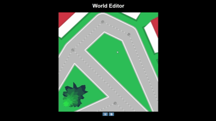

# Virtual World Editor with Pseudo-3D Structures

An interactive web-based spatial graph editor for designing road networks with realistic pseudo-3D buildings and trees. Create complex urban environments with procedurally generated structures, automatic collision detection, and perspective-based rendering — all in vanilla JavaScript.



## Features

### Interactive Graph Editor
- **Node-based road design:** Left-click to create intersection points
- **Segment connections:** Connect nodes to form road networks
- **Real-time manipulation:** Drag nodes to reposition; roads update dynamically
- **Smart deletion:** Right-click nodes to remove them along with connected roads

### Dynamic Viewport
- **Zoom control:** Mouse wheel to zoom (1x–5x magnification)
- **Pan navigation:** Middle mouse button + drag to explore large environments
- **Smooth rendering:** 60 FPS canvas updates with requestAnimationFrame

### Advanced Road Generation
- **Curved envelopes:** Configurable road width and corner roundness
- **Intersection merging:** Polygon union algorithm eliminates overlapping segments
- **Clean borders:** White road edges with dashed centerlines for visual clarity

### Pseudo-3D Structures

#### Buildings
- **Procedural generation:** Automatically placed along road borders with configurable spacing
- **Perspective rendering:** Uses `getFake3dPoint()` with distance-based atan scaling for realistic depth
- **Peaked roofs:** Red gabled roofs with depth-sorted polygons for proper occlusion
- **Collision avoidance:** Buildings are filtered to prevent intersections using `intersectsPoly()`

#### Trees
- **Organic placement:** Randomized positions with noise-based edge variation
- **Multi-level rendering:** 7 gradient-shaded polygons create volumetric canopy effect
- **Smart distribution:** Trees avoid roads, buildings, and each other with configurable margins

### Persistent Storage
- **LocalStorage integration:** Save/load entire world state including graph topology
- **Session recovery:** Restore previous designs on page reload

## Tech Stack

- **HTML5 Canvas API** – Hardware-accelerated 2D rendering
- **Vanilla JavaScript (ES6+)** – Zero dependencies, fully client-side
- **Computational geometry** – Intersection detection, polygon operations, perspective projection

## Key Algorithms & Solutions

### Problem 1: Building Polygon Intersections

**Challenge:** Buildings generated along parallel roads overlap when placed too close together.

**Solution:**
1. **Intersection detection:** Added `Polygon.intersectsPoly()` method that checks if any segment pairs from two polygons intersect using line-segment intersection tests
2. **Distance validation:** Implemented `Polygon.distanceToPoly()` to ensure minimum spacing between adjacent buildings
3. **Iterative filtering:** During building generation, each new building is compared against all existing buildings:
   ```javascript
   if(bases[i].intersectsPoly(bases[j]) || 
      bases[i].distanceToPoly(bases[j]) < this.spacing) {
       bases.splice(j, 1);
   }
   ```

**Result:** Buildings maintain clean separation with configurable spacing parameter.

### Problem 2: Tree Placement and Overlaps

**Challenge:** Randomly placed trees intersect with roads, buildings, and each other, creating unrealistic scenes.

**Solution:**
1. **Illegal zone detection:** Created array of forbidden polygons including road envelopes and building bases
2. **Multi-constraint validation:**
   - **Road/building avoidance:** `poly.containsPoint(p)` and `poly.distanceToPoint(p) < treeSize/2`
   - **Tree-to-tree spacing:** Check distance between tree centers to prevent clustering
   - **Proximity requirement:** Ensure trees are near structures (`distanceToPoint(p) < treeSize*2`) to avoid isolated trees
3. **Retry mechanism:** Loop with 100-attempt limit generates valid positions or skips placement

**Result:** Natural-looking tree distribution that respects urban boundaries.

### Problem 3: 3D Perspective Without Growing on Zoom

**Challenge:** Initial implementation scaled building height by distance from viewport, causing buildings to grow taller when zooming out.

**Solution:**
1. **Fixed height model:** Changed from relative `heightCoef` to absolute `height = 200` pixels
2. **Perspective projection:** Implemented `getFake3dPoint()` using arctangent-based scaling:
   ```javascript
   const scaler = Math.atan(dist / 300) / (Math.PI / 2);
   return add(point, scale(dir, height * scaler));
   ```
   - Distance normalized by constant (300px) creates consistent perspective
   - Atan function provides realistic depth falloff
   - Height remains constant; only projection angle changes

**Result:** Buildings maintain stable height across all zoom levels while still appearing 3D.

### Problem 4: Depth Sorting for Occlusion

**Challenge:** Buildings and trees rendered in creation order caused front objects to be hidden behind distant ones.

**Solution:**
1. **Unified item array:** Merged buildings and trees into single sortable collection
2. **Distance-based sorting:**
   ```javascript
   items.sort((a,b) => 
       b.base.distanceToPoint(viewPoint) - a.base.distanceToPoint(viewPoint)
   );
   ```
3. **Far-to-near rendering:** Draw distant objects first, near objects last

**Result:** Proper occlusion with objects correctly overlapping based on viewer position.

## Project Architecture

```
js/
├── graphEditor.js          # User interaction & node/edge manipulation
├── viewport.js             # Camera system (zoom, pan, coordinate transforms)
├── world.js                # Scene generation & structure placement
├── items/
│   ├── building.js         # 3D building with roof rendering
│   └── tree.js             # Multi-level organic tree rendering
├── math/
│   ├── graph.js            # Spatial graph data structure
│   └── utils.js            # Geometry utilities (intersection, projection, perspective)
└── primitives/
    ├── point.js            # 2D point with rendering
    ├── segment.js          # Line segment with distance/projection methods
    ├── polygon.js          # Polygon with union, intersection, containment tests
    └── envelope.js         # Rounded-corner polygon generation
```

## How to Use

1. **Open `index.html`** in a modern browser (Chrome, Firefox, Safari, Edge)
2. **Design a road network:**
   - Click canvas to add intersection nodes
   - Click two nodes in sequence to connect them
   - Drag nodes to adjust layout (roads + structures update in real-time)
   - Right-click nodes to delete

3. **Navigate the scene:**
   - Scroll mouse wheel to zoom
   - Middle-click + drag to pan
   - Buildings and trees render with proper 3D perspective

4. **Manage your world:**
   - Click 📄 to save to localStorage
   - Click 🗑️ to clear and start fresh

## Performance Considerations

- **Spatial indexing:** Buildings use O(n²) intersection checks; consider quadtree for 100+ buildings
- **Tree generation:** Limited to 100 attempts per generation to prevent infinite loops
- **Render culling:** All objects drawn every frame; consider viewport-based culling for large worlds

## Future Enhancements

- **Varied building heights:** Randomize height parameter for skyline diversity
- **Shadows:** Add pseudo-shadows based on sun direction
- **Animated trees:** Wind sway using sinusoidal vertex displacement
- **Traffic simulation:** Add moving vehicles along road network
- **Export formats:** SVG/OBJ export for use in 3D modeling tools
- **Texture mapping:** Apply brick/wood patterns to building facades

## Known Limitations

- Buildings assume rectangular bases (4 vertices); irregular polygons not supported for roofs
- Tree collision uses center-point distance; doesn't account for canopy overlap
- No undo/redo (changes are permanent until cleared)
- Single user only (no real-time collaboration)

