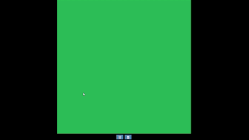

# Road Network Editor

An interactive web-based tool for designing and visualizing road networks in real time. Create road segments, automatically generate curved road envelopes, and seamlessly merge intersecting roads with clean borders.



## Features

- **Interactive Graph Editor**
  - Left-click to create nodes (road intersections)
  - Connect nodes to form road segments
  - Left-click + drag to reposition nodes
  - Right-click to delete nodes and connected roads

- **Dynamic Viewport**
  - Mouse wheel to zoom (1x–5x)
  - Middle mouse button + drag to pan
  - Real-time rendering with smooth interactions

- **Road Generation**
  - Automatically generate curved road envelopes with configurable width and roundness
  - Eliminates overlapping road intersections using polygon union algorithm
  - Renders clean white road borders with dashed centerlines

- **Persistent Storage**
  - Save road networks to browser localStorage
  - Restore previously saved designs on page reload

## Tech Stack

- **HTML5 Canvas API** – 2D rendering
- **Vanilla JavaScript (ES6+)** – No external dependencies
- **Geometric algorithms** – Intersection detection, polygon operations

## How to Use

1. **Open `index.html`** in a modern web browser (Chrome, Firefox, Safari, Edge)
2. **Create a road network:**
   - Click on the canvas to add intersection nodes
   - Click two nodes in sequence to connect them with a road segment
   - Drag nodes to adjust positions (roads update in real-time)
   - Right-click a node to delete it and connected roads

3. **Navigate the canvas:**
   - Scroll to zoom in/out
   - Middle-click + drag to pan

4. **Manage data:**
   - Click 📄 to save your network
   - Click 🗑️ to clear everything

## Project Structure

```
js/
├── graphEditor.js          # Node/edge interaction handling
├── viewport.js             # Camera system (zoom & pan)
├── world.js                # Road generation & rendering
├── math/
│   ├── graph.js            # Graph data structure
│   └── utils.js            # Geometric utilities
└── primitives/
    ├── point.js            # Node representation
    ├── segment.js          # Edge representation
    ├── polygon.js          # Polygon with union/intersection
    └── envelope.js         # Road envelope generation
```

## Key Algorithms

- **Polygon Union:** Merges overlapping road envelopes and removes interior segments
- **Intersection Detection:** Identifies road crossing points for clean border generation
- **Envelope Generation:** Creates smooth-cornered road shapes from centerline segments