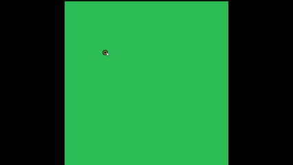

# Dynamic Viewport Graph Editor

A powerful, interactive browser-based tool for creating and manipulating spatial graphs in real time. The Dynamic Viewport Graph Editor combines an intuitive node-and-edge interface with a dynamic viewport system, allowing users to navigate large graph structures with zoom and pan capabilities.

## Overview



The Dynamic Viewport Graph Editor is designed for applications requiring interactive graph visualization and manipulation, including:

- **Road network modeling** for autonomous driving simulations
- **Graph algorithm visualization** and testing
- **Network topology design** and prototyping
- **Educational tools** for computer science and discrete mathematics

### Key Features

- **Interactive Node & Edge Creation:**  
  Add nodes with a left-click and connect them by selecting consecutive nodes.

- **Real-Time Manipulation:**  
  Drag nodes to reposition them; connected edges update instantly.

- **Intuitive Node Deletion:**  
  Right-click nodes to remove them with automatic cleanup of connected edges.

- **Dynamic Viewport System:**  
  - **Zoom:** Mouse wheel scrolling to zoom in and out (1x to 5x magnification)
  - **Pan:** Middle mouse button drag to pan across the canvas
  - Viewport transformations preserve graph editing functionality

- **Hover & Selection Feedback:**  
  Visual highlighting for hovered nodes (yellow fill) and selected nodes (yellow outline).

- **Persistent Storage:**  
  Save and load graphs via browser localStorage.

- **Clean UI:**  
  Simple controls with save and clear functionality.

## Tech Stack

- **HTML5:** Semantic markup and Canvas API for rendering
- **CSS3:** Styling and responsive design
- **Vanilla JavaScript (ES6+):** No dependencies—pure client-side implementation
- **Canvas API:** Efficient 2D graphics rendering

**Why Vanilla JavaScript?**  
Eliminating external dependencies ensures lightweight deployment, maximum compatibility, and a clear, maintainable codebase ideal for learning and extending.

## Architecture

### Project Structure

```
.
├── index.html                 # Main application entry point
├── styles.css                 # Application styling
├── js/
│   ├── viewport.js           # Viewport & camera control system
│   ├── graphEditor.js        # User interaction & graph editing logic
│   ├── math/
│   │   ├── graph.js          # Graph data structure & operations
│   │   └── utils.js          # Geometric utility functions
│   └── primitives/
│       ├── point.js          # Node representation & rendering
│       └── segment.js        # Edge representation & rendering
└── assets/
    └── dynamicViewport.gif   # Demo animation
```

### Core Components

#### **ViewPort Class** (`viewport.js`)
Manages the camera system and coordinate transformations:
- Handles zoom via mouse wheel (clamped between 1x–5x)
- Enables panning via middle mouse button drag
- Transforms world coordinates to screen coordinates
- Maintains center point and offset for proper rendering

#### **GraphEditor Class** (`graphEditor.js`)
Orchestrates user interactions and graph editing:
- Detects nearest node for hover states
- Handles node creation, selection, and deletion
- Manages edge creation between selected nodes
- Supports dragging nodes with real-time updates
- Delegates rendering to the graph model

#### **Graph Class** (`graph.js`)
Core data structure managing the spatial graph:
- Stores collections of points and segments
- Prevents duplicate points and segments
- Automatically cascades deletion (removing a point removes connected edges)
- Serializes to JSON for persistent storage
- Renders all nodes and edges to the canvas

#### **Point Class** (`point.js`)
Represents individual nodes:
- Stores x, y coordinates
- Renders as circles with configurable size, color, fill, and outline
- Supports equality comparison

#### **Segment Class** (`segment.js`)
Represents edges connecting two points:
- Stores references to connected points
- Renders as lines with configurable width, color, and dash patterns
- Supports equality comparison and point membership testing

### Data Flow

```
User Input (Mouse Events)
    ↓
GraphEditor (Event Handlers)
    ↓
Graph Model (Add/Remove Points & Segments)
    ↓
ViewPort (Transform Coordinates)
    ↓
Canvas (Render via requestAnimationFrame)
```

## How It Works

### Node Creation
1. User clicks on the canvas
2. GraphEditor detects no existing node at that location
3. A new Point is added to the graph
4. The node is automatically selected
5. The graph is redrawn on the next animation frame

### Edge Creation
1. User selects a node (left-click on existing node)
2. User selects another node
3. GraphEditor creates a Segment connecting them
4. The edge appears on the canvas

### Node Deletion
1. User right-clicks an unselected node
2. GraphEditor calls `removePoint()` on the graph
3. All connected edges are automatically removed
4. The graph is redrawn

### Viewport Navigation
- **Zoom:** Scroll mouse wheel up to zoom in, down to zoom out
- **Pan:** Hold middle mouse button and drag to move the viewport
- **Real-time Sync:** Graph editing works seamlessly while panned/zoomed

## Setup & Usage

### Prerequisites
- Any modern web browser (Chrome, Firefox, Safari, Edge)
- No server or build tools required

### Running Locally

1. **Clone the repository:**
   ```bash
   git clone https://github.com/KarunyaChavan/Self_Driving_Cars_in_VirtualWorld.git
   cd Self_Driving_Cars_in_VirtualWorld
   ```

2. **Open in your browser:**
   ```bash
   # Option 1: Direct file open
   open index.html
   
   # Option 2: Using a local server (Python)
   python -m http.server 8000
   # Then navigate to http://localhost:8000
   ```

### Usage Instructions

| Action | Result |
|--------|--------|
| **Left-click on canvas** | Create a new node or start edge selection |
| **Left-click + Drag** | Reposition a selected node |
| **Right-click node** | Delete the node and connected edges |
| **Scroll wheel** | Zoom in/out (1x–5x) |
| **Middle-click + Drag** | Pan across the viewport |
| **🗑️ Button** | Clear all nodes and edges |
| **📄 Button** | Save the graph to browser storage |

## Persistence

Graphs are automatically saved to browser `localStorage` when you click the save button. On page reload, the previously saved graph is restored.
